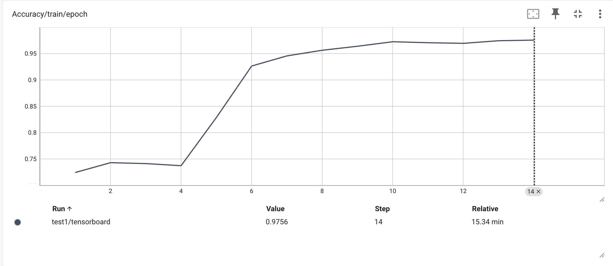

# chest-xray

### Link to code and more: [https://github.com/jblitzar/chest-xray](https://github.com/jblitzar/chest-xray)

Hoping to create a project with the potential for real-world impacts, I built an CNN-based AI pneumonia classifier using the NIH Chest Xray dataset, hoping to gain insights about both the prospects and the potential challenges of using AI for disease flagging. I was able to get 95% training accuracy and 82% validation accuracy. It taught me many things:

Unexpected information can cause spurious correlations and overfitting, so it’s important to make the AI focus on just the chest area. Also, image quality matters, so you need to make sure images are processed in a consistent way.

For my next version, I hope to implement a preprocessing and masking pipeline to focus on only the chest region.

### Project:

AI can effectively and accurately be used to classify radiological images to aid with diagnoses.

### Process:

The first step in any Machine Learning project is to find and prepare a good dataset. For this project, I decided to use the [NIH Chest Xray Dataset](https://www.kaggle.com/datasets/nih-chest-xrays/data). This dataset is great for a couple of reasons:

1. The task itself is well-suited for neural networks: Images that you have to sort into classes.
2. The images themselves are high-resolution and generally normalized.

The code for the dataset loading is in [dataset.py](https://github.com/JBlitzar/chest-xray/blob/main/dataset.py)

Next, I began by creating the training pipeline, located in [trainingmanager.py](https://github.com/JBlitzar/chest-xray/blob/main/trainingmanager.py). This extendable framework allowed me to quickly iterate without wasting my time on the boilerplate code. Within this, we have the metrics we wish to optimize for: In this case, I selected BCELoss, the classic one to use for classification pipelines like this. While initially a lot of work, the effort paid off: a clean OOP system and an accessible API.

> ${(y\log(p) + (1 - y)\log(1 - p))}$   Binary Cross Entropy Loss formula.

Then, I created the architecture. The code for this can be found in [architecture.py](https://github.com/JBlitzar/chest-xray/blob/main/architecture.py). I started with a simple CNN, comparable to the [LeNet architecture](https://en.wikipedia.org/wiki/LeNet).

Graph of loss over time

- To view tensorboard loss curves etc, run `tensorboard --logdir runs` and navigate to http://localhost:6006s
- For more insight into my process, check out [NOTES.md](NOTES.md)
